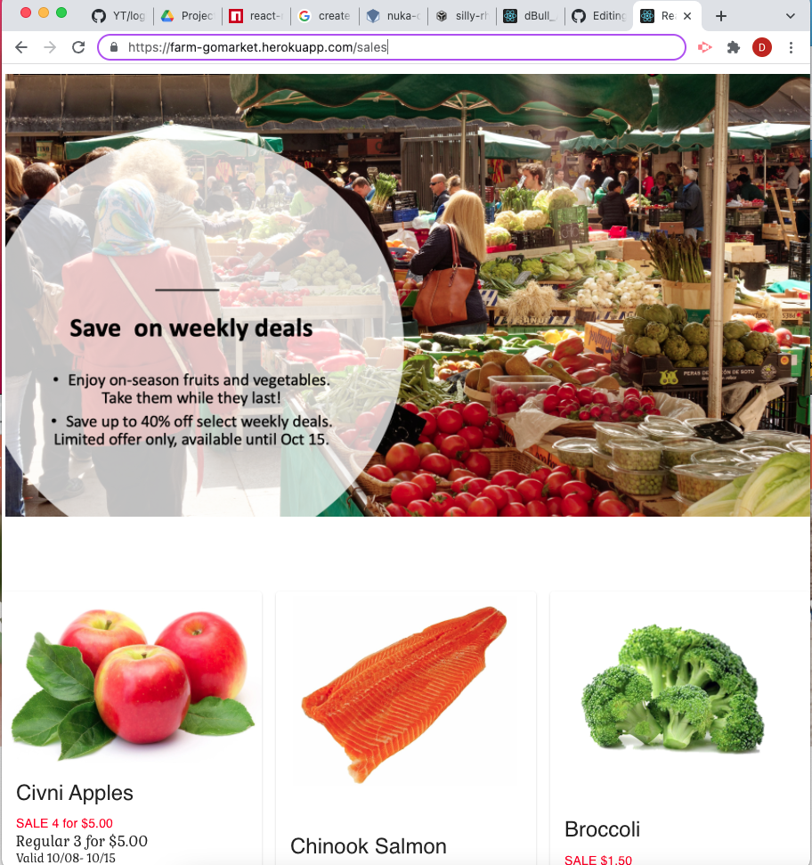

## FarmGo Market app 🌿

# 

<p style="align-contents: center";>



<br>


## Description 
 The Farm Go Market application is an online farmers market.. By creating an account the user will be able to select their products and save them for checkout. This application is built using the MERN sack and REACT front end. The database is composed with MONGODB and Node.js/ Express.js server and API. The app is also constructed with a GraphQL using RESTful API through Apollo Server. 


* [Heroku Link](https://farm-gomarket.herokuapp.com/)


## User Story 
```md
As a user
I want to be able to create a user profile and search for farmer’s market by location
So that I can
Save the market on my profile
```


## Acceptance Criteria 
```md
WHEN I load the page
THEN I am presented with a menu with options to Signup, Products, Coupons, Categories, Order History and Cart
WHEN I click on the Signup option
THEN I am presented with first/last name, email and password as well as an option to login
WHEN I input all required information and click submit button
THEN my user account is created, and I am logged in to the site
WHEN Login is selected
THEN I am presented with two inputs: email and password
WHEN I enter email and password and click the login button
THEN I am logged in to the site
WHEN I am logged in and select Products option
THEN I am presented with a list of all available products 
WHEN I select Cart option
Then I am presented with all the items I selected as well as a checkout button
WHEN I press the checkout button then I will be redirected to payment website and once payment is complete I will be sent back to FarmGo Market
WHEN I select Order History
THEN I am presented with all previous purchase orders
WHEN I select Coupons
THEN I am presented with a list of current items on sale

```


## Table of Contents (Optional)


* [Installation](#installation)
* [Usage](#usage)
* [Credits](#credits)
* [License](#license)


## Usage 
* Run `npm i` 
* Run `npm start` 
* `navigate on browser!` 

[FarmGo Market App Demo](https://farm-gomarket.herokuapp.com/sales)

🏆 
## Badges


## Contributing / Credits

* [chasemcquown](https://github.com/chasemcquown)
* [RiveraDenisse](https://github.com/RiveraDenisse)
* [Bullbotbam](https://github.com/Bullbotbam)
* [mariamv29](https://github.com/mariamv29/README-generator.git)
